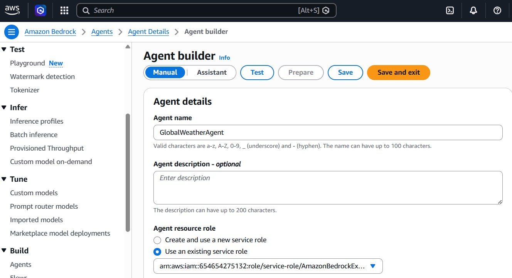
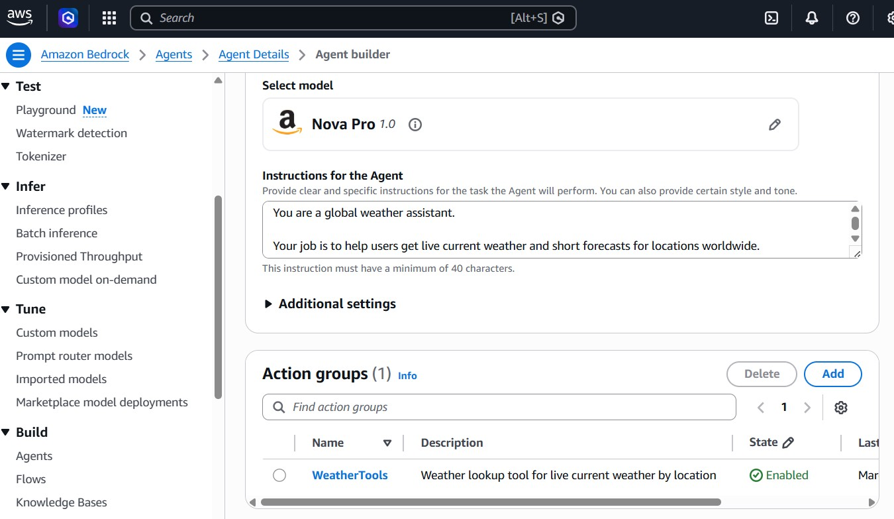
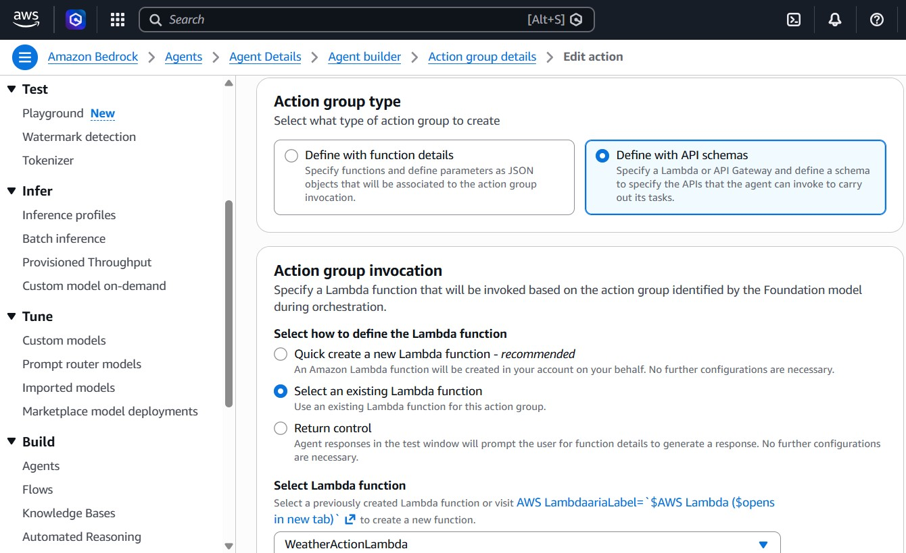
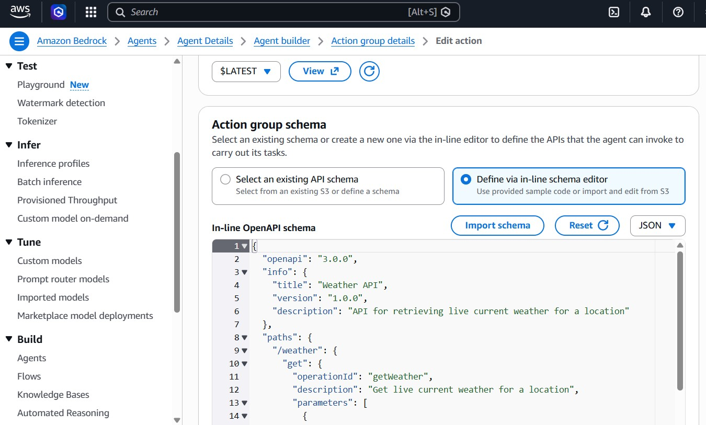
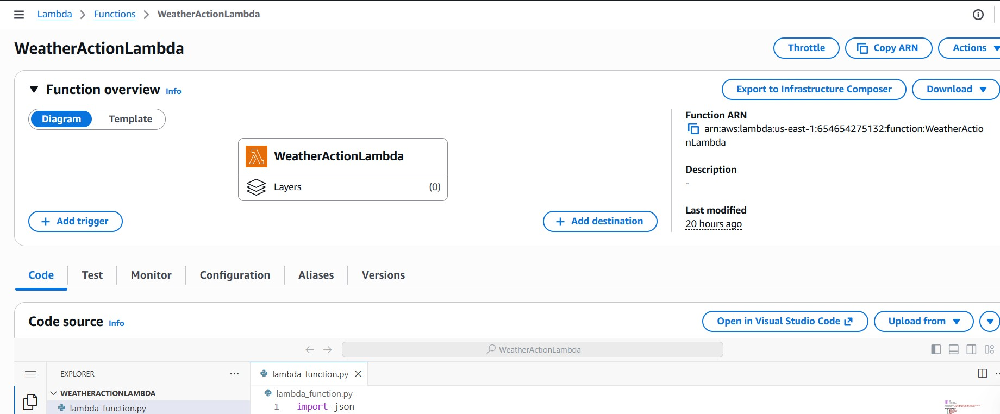
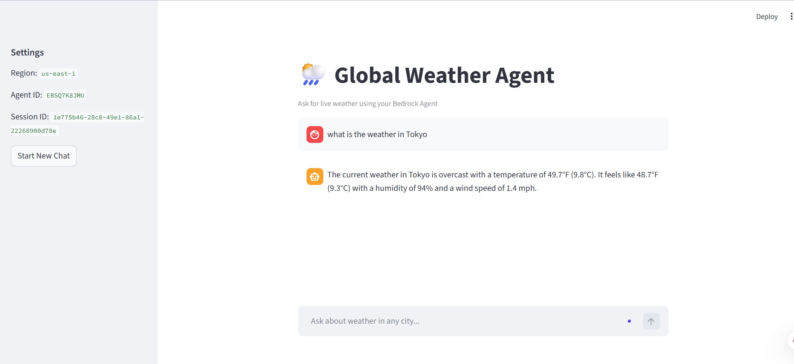

**AWS Bedrock Global Weather Agent** 🌦️


A production-style generative AI weather assistant built using **Amazon Bedrock Agents**, **Amazon Nova**, **AWS Lambda**, **Open-Meteo APIs** and **Streamlit**.

This project demonstrates how a large language model can dynamically invoke external tools to retrieve **live weather data** instead of relying on static model memory.

🚀 **What This Project Does**

A user asks a natural language question such as:

```text

What is the weather in Tokyo?

```

The system:


1\. Sends the prompt to an Amazon Bedrock Agent

2\. The agent determines weather data is needed

3\. Invokes a tool (Action Group)

4\. Calls AWS Lambda

5\. Lambda fetches live weather from external APIs

6\. Returns structured JSON

7\. Bedrock formats the final natural language answer


☁️ **AWS Services Used**

| Service        | Purpose                 |

| -------------- | ----------------------- |

| Amazon Bedrock | Agent orchestration     |

| Amazon Nova    | Foundation model        |

| AWS Lambda     | External tool execution |

| IAM            | Permissions             |

| CloudWatch     | Lambda logging          |


🧠 **Why Bedrock Agent Instead of Direct LLM Call**

A normal LLM cannot know live weather reliably.

Bedrock Agent adds:

\* tool calling
\* structured orchestration
\* parameter extraction
\* external API execution
This enables \*\*live factual retrieval\*\*.

🔧 **Core Components**
1. Bedrock Agent
Handles:
\* user intent detection
\* tool selection
\* response orchestration

Agent instruction defines:

\* when to use tools
\* how to format output
\* unit preferences

2. Action Group
Action group name:
```text

WeatherTools

```
Defines callable API contract through OpenAPI schema.
\* Parameters
\* location
\* unit

3. AWS Lambda
Lambda performs:
Step A — Geocoding
Converts city name:
```text

Tokyo → latitude / longitude

```
Using Open-Meteo geocoding API.
Step B — Weather Retrieval
Fetches:
\* temperature
\* feels like
\* humidity
\* wind
\* condition

Step C — JSON Response
Returns structured payload back to Bedrock.

4. Streamlit Frontend
Provides chat interface for local testing.


**Code Walkthrough**

**app.py**

Handles:

\* Streamlit chat UI

\* Bedrock invoke\_agent call

\* Session handling

**weather\_lambda.py**

Handles:

\* parameter extraction

\* external API calls

\* weather normalization

**weather-openapi.json**

Defines:

\* action group interface

\* tool parameters

💻**Local Setup**

Install dependencies
```bash

pip install -r requirements.txt

```
Run Streamlit app
```bash

streamlit run app.py

```
🔐**AWS Credentials Required**

Local machine must already have:
```bash

aws configure

```
configured with a user that has:

\* bedrock:InvokeAgent

\* bedrock:InvokeModel

\* bedrock:InvokeModelWithResponseStream

📂 **Repository Structure**

```text
aws-bedrock-global-weather-agent/
│── app.py
│── requirements.txt
│── README.md
│── docs/
│   ├── bedrock1.jpg
│   ├── bedrock2.jpg
│   ├── lambda.jpg
│   ├── actiongroup1.jpg
│   ├── actiongroup2.jpg
│   ├── streamlit.jpg
│── lambda/
│── schemas/
│── iam/
```

🔐 **IAM Security Design**

This implementation uses two permission layers:

**Local IAM User**

Required for invoking the Bedrock Agent from local development environment:

* bedrock:InvokeAgent
* bedrock:InvokeModel
* bedrock:InvokeModelWithResponseStream

**Agent Execution Role**

Attached to Bedrock Agent runtime for model invocation:

* bedrock:InvokeModel
* bedrock:InvokeModelWithResponseStream

**Lambda Execution Role**

Used for:

* CloudWatch logging
* outbound HTTPS API calls

This separation follows least-privilege design.

Local IAM User Requires
```json

{

 "Effect": "Allow",
 "Action": [
   "bedrock:InvokeAgent",
   "bedrock:InvokeModel",
   "bedrock:InvokeModelWithResponseStream"
],
 "Resource": "*"
}

```

Agent Execution Role Requires
```json

{

 "Effect": "Allow",
    "Action": [
    "bedrock:InvokeModel",
    "bedrock:InvokeModelWithResponseStream"
 ],
 "Resource": "*"
}

```

🧪Example Prompt


```text

What is the weather in Tokyo?

```

Example Response
```text

Location: Tokyo

Condition: Mainly clear

Temperature: 47.8°F

Feels like: 45.9°F

Humidity: 68%

Wind: 7 mph

```
🏗️ **Architecture Flow**

```text
User Prompt
   ↓
Streamlit UI
   ↓
Amazon Bedrock Agent
   ↓
Action Group (WeatherTools)
   ↓
AWS Lambda
   ↓
Open-Meteo APIs
   ↓
Structured JSON Response
   ↓
Natural Language Answer
```

📸 **Screenshots**


**Bedrock Agent**

> Bedrock agent configuration showing production-style action group orchestration and model selection.







**Action group**








**Lambda Console**

> Lambda tool implementation for external weather API execution and structured JSON response contract.





**Streamlit UI**





⚠️ **Troubleshooting**

AccessDeniedException:

Usually caused by missing IAM permission.

Anthropic Model Failed:

Anthropic required AWS Marketplace permissions

\* aws-marketplace:Subscribe

\* aws-marketplace:ViewSubscriptions

To avoid this, project was migrated to **Amazon Nova**.

Alias Validation Error:

Ensure:
```python

AGENT\_ALIAS\_ID = "REAL\_ALIAS\_ID"

```
Use alias ID, not alias name.

🧭 **Key Learning Outcomes**

This project demonstrates:

\* Agentic AI architecture

\* Tool invocation using Bedrock Agents

\* Lambda event contract handling

\* Live API integration

\* Prompt + tool alignment

\* Session-based conversational AI

🏆 **Why This Project Matters**

This is not just a weather demo.

It demonstrates the same pattern used in enterprise AI systems:

\* control assistants

\* operational copilots

\* intelligent workflow agents

\* tool-driven enterprise GenAI

👤 **Author**

Built as a practical Bedrock Agent implementation to explore real-world orchestration patterns involving foundation models, external tools, Lambda execution, and conversational UI integration.


